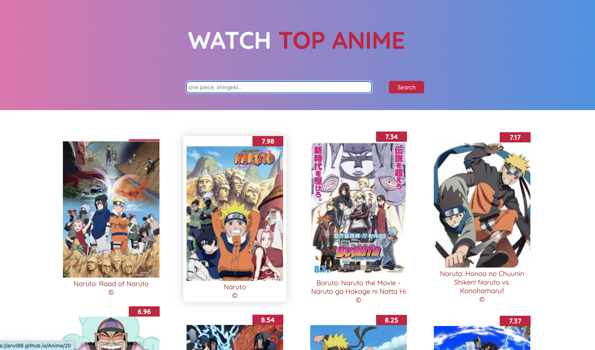
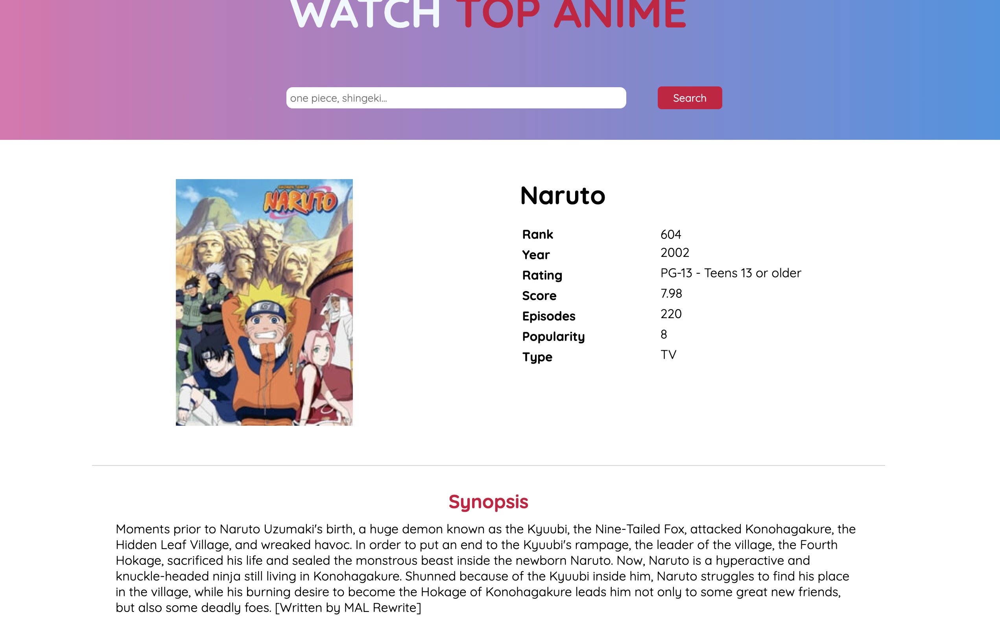

# WATCH TOP ANIME 

> The WATCH TOP ANIME is a platform where you can get information of any current animes.

## Image Preview

##  Live Demo
- [Demo](https://anvi98.github.io/topAnime/)

## What was built in this project:

- Interactive page That fetches an Api and retrieve some informations.

- Display all animes depending on the requests.

## Built With

- Use JavaScript to make websites dynamic and build basic single page apps.
- React 18
- React Router V6
- React-Redux
- Redux
- Native Fetch
- Use ES6 syntax.
- Use ES6 modules.
- Use callbacks and promises.
- Use webpack.
- Apply JavaScript best practices and language style guides in code.
- Use AAA pattern for unit tests.
- Solve simple git conflicts.
- Send and receive data from an API.
- Use API documentation.
- Understand and use JSON.
- Make JavaScript code synchronous.

## Api Used

- [Jinkan](https://jikan.moe/)

### Usage

- Clone the repo.

- Run `npm install` on your terminal.

- Run `npm run build` on your terminal.

- Open the terminal in your machine and run `npm run serve` to start the local server.

## Author

👤 **Alex Anvi Eponon**

- GitHub: [@Alex](https://github.com/Anvi98)

## 🤝 Contributing

Contributions, issues, and feature requests are welcome!

Feel free to check the [issues page](https://github.com/Anvi98/topAnime/issues).

## Show your support

Give a ⭐️ if you like this project!
